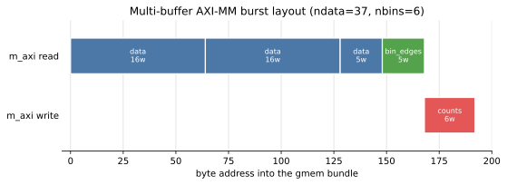
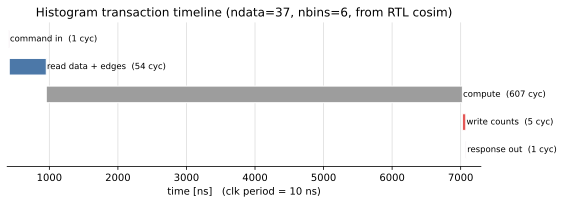

# Viewing Timing and Bursts

The [RTL simulation](rtlsim.md) page produced a cosim waveform and a burst report.
This page turns those into two pictures — the multi-buffer **burst layout** and
the transaction **timeline** — and documents how the figures are committed and
refreshed. Both are rendered by `shared_mem_figures.py` from the cosim burst
report (`vcd/burst_info.json`), which is itself regenerable from the **committed**
`vcd/dump.vcd` with no Vitis run.

## The burst layout



This is the figure unique to the shared-memory example — the visual payoff of the
multi-buffer m_axi story. It shows where, in the one `gmem` bundle, each buffer
lives and how the `m_axi` master bursts it, for the `ndata=37, nbins=6` vector:

- **`data` (read, 37 words from byte 0)** is split into **three bursts** —
  `16 + 16 + 5` words. The `m_axi` interface has a maximum burst length (16 words
  here), so a 37-word read becomes three back-to-back bursts rather than one
  37-beat transfer. This splitting is automatic; the kernel just asked for 37
  elements.
- **`bin_edges` (read, 5 words from byte 148)** is one short burst, immediately
  after the data region — `5` words because `nbins-1 = 5` edges define 6 bins.
- **`counts` (write, 6 words from byte 168)** is the one write burst — `nbins = 6`
  count words, after both input regions.

Read the address axis left to right and you are reading the memory map the
[command](aximm.md) chose: `data_addr = 0`, `bin_edges_addr = 148`,
`cnt_addr = 168`, back-to-back because the allocator placed them in that order.
Two element types (float reads, uint32 write), three buffers, one bundle — exactly
what the example set out to exercise.

## The transaction timeline



This is the same transaction over time, broken into phases and annotated with
cycle counts (the clock period is 10 ns). It reads as the
[execution model](aximm.md) did: command in → read the inputs → compute → write
the counts → response out.

The shape is worth noting: **compute dominates**. The two `m_axi` reads finish in
tens of cycles, and the write is a handful more, but the binning loop over 37
samples is hundreds of cycles — so the memory traffic is a small slice of the
transaction. That is a real and useful reading: for this kernel the bottleneck is
the datapath, not the bus, which is why the multi-buffer burst *efficiency* (the
read splitting above) costs so little of the total. A heavier-data / lighter-
compute kernel would show the opposite balance.

The cosim timeline is what the [SimPy model](pysim.md) was approximating; here the
phase boundaries and the burst latencies are measured from real synthesized RTL.

## How the figures are committed

The docs site cannot run Vitis or SimPy at build time, and committing a freshly
generated figure on every run would churn binary blobs in git constantly. So the
figures live in **three places**, with a deliberate promotion between them:

| Location | Tracked? | Role |
| -------- | -------- | ---- |
| `examples/shared_mem/results/*.svg` | gitignored | generated each render — never committed |
| `docs/examples/shared_mem/images/*.svg` | committed | the stable assets these pages embed |
| `docs/examples/shared_mem/images/sync_status.json` | committed | provenance: each figure's source path + content hash |

The render steps (`generate_burst_diagram`, `generate_timing_diagram`) write into
`results/`; a separate **`SyncDocsFiguresStep`** copies them into `images/` on
demand, driven by an explicit manifest (`results/... → docs/.../images/...`). The
sync never copies by guesswork — the manifest is the reviewable mapping, and the
copy is a normal `git diff` you choose to commit.

## Refreshing the figures

The whole workflow runs from `hist_build.py`:

```bash
cd examples/shared_mem
python hist_build.py --through sync_docs_figures
```

That renders both SVGs from `vcd/burst_info.json` and syncs them into `images/`.
If `burst_info.json` is missing, the render step regenerates it from the committed
`vcd/dump.vcd` — so a routine figure refresh needs **no Vitis**, only matplotlib
(already required by the example's timing utilities).

To refresh against *new* hardware behavior — after changing the kernel, the
buffer sizes, or the test vector — regenerate the cosim artifacts first, then sync:

```bash
python hist_build.py --through extract_bursts --trace-level port  # new dump.vcd + burst_info.json (needs Vitis)
python hist_build.py --through sync_docs_figures           # re-render + sync
git diff docs/examples/shared_mem/images/                        # review, then commit
```

Because the SVGs are rendered deterministically (a fixed `svg.hashsalt`, no
embedded timestamp), a re-sync produces a **byte-identical** file when nothing
changed — so the `git diff` is empty unless the hardware behavior actually moved.
`sync_status.json` records each figure's source content hash at the last sync, a
cheap staleness signal a docs lint can check without re-running anything.

## Next

This is the last page of the shared-memory walkthrough. For the broader
references, see:

- [Build System](../../guide/build/index.md) — the `BuildDag` / `BuildStep`
  reference behind the figure workflow.
- [Interfaces](../../guide/interface/index.md) — the AXI-MM / stream abstractions.
- The [examples index](../) — the five-pattern progression this example sits in.
